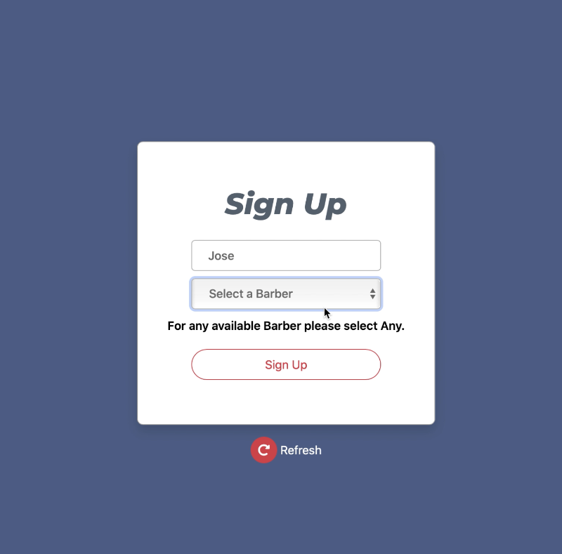
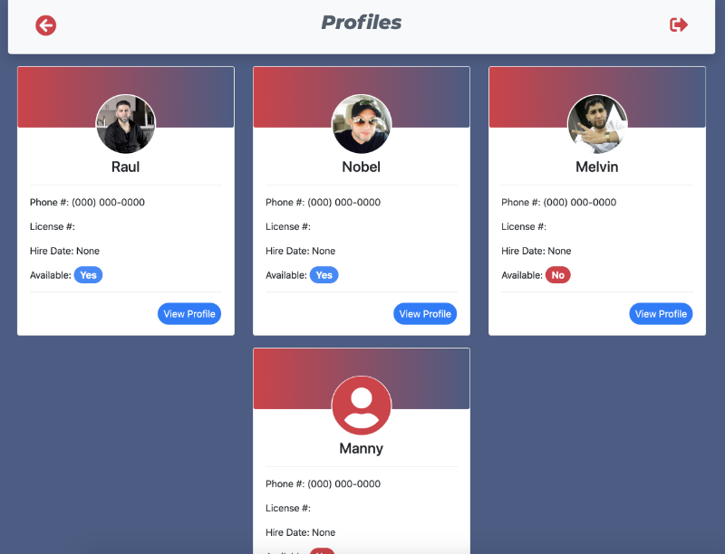

# Barbershop Kiosk

## This is a Kiosk System to keep track of the walking clients in a barbershop.

## Sign Up View
### The client walking into the barbershop and sign up in a tablet kiosk with Name and preferred barber.

## Name

## Select a barber

## Waiting Room View
### Clients will see thier names, preferred barber and check in time on a display in the waiting room. The display will show the estimated waiting time.

## Barber Profiles
### Each barber has their own profile.

## Barber Profile
### Here they will see which client is waiting for them and they will have a service button when they start serving the client and a completed button when they finish with the client. Each profile is filtered to see only the customers waiting for you or customers that selected ANY. Barbers can update available status to let customer know if their available to take any walking customer.

